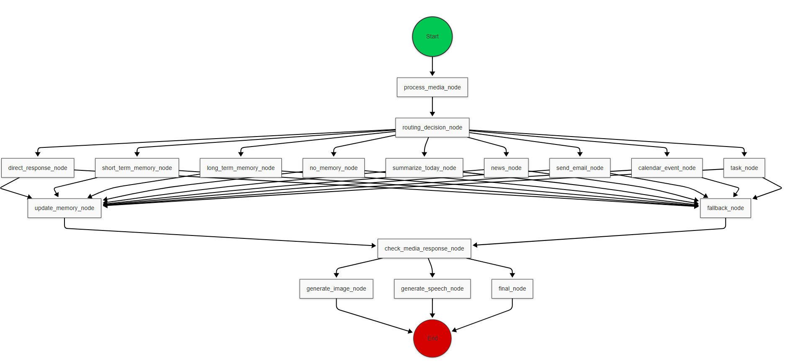

# Multi-Agent AI Assistant Integrated with WhatsApp

## 📲 Overview

An advanced, **multi-modal AI** assistant leveraging state-of-the-art LLMs, integrated seamlessly with WhatsApp to perform complex tasks via natural interactions. Built with **LangChain** and **LangGraph**, the system employs a scalable **multi-agent** architecture capable of processing text, audio, and images to automate:

- Email management
- Calendar scheduling
- Task tracking
- Daily summaries
- Real-time news retrieval

---

## 🤖 Key Features

### 🔗 Multi-Modal Communication
- Interact through text, voice messages, or images directly in WhatsApp

### 🗣 Speech-to-Text & Text-to-Speech
- Transcribe voice messages and generate voice responses

### 🖼 Image-to-Text & Text-to-Image
- Process images with text and generate images from text descriptions

### 🧩 Google Workspace Integration
- **Email Management**: Send and receive emails through a conversational interface
- **Calendar Management**: Schedule meetings and view upcoming events
- **Task Management**: Create and track to-do items

### ⏰ Automated Daily Briefing
Receive a morning summary of:
- Previous 24 hours' emails
- Today's calendar events
- Pending tasks

### 🌐 Real-Time Information
- Query for current news from around the world

### 🧠 Context-Aware Conversations
- Maintains short-term memory for natural dialogue

### 🗃 Long-Term Memory
- Stores important information using RAG (Retrieval Augmented Generation)

### 💻 Web UI
- Alternative interface through Chainlit for desktop access

---

## 🧰 Technology Stack

| Category              | Technology                     |
|----------------------|---------------------------------|
| Framework            | FastAPI                         |
| Multi-Agent System   | LangGraph (nodes, edges, graph), LangChain |
| Text Agent           | Grok                            |
| Voice Agent                | ElevenLabs (TTS), Whisper (STT) |
| Image Agent                | Llama (ITT), Together AI (TTI)  |
| Memory               | SQLite (short-term), Qdrant (RAG)|
| Data Orchestration        | Prefect                         |
| UI                   | Chainlit                        |
| Scheduling           | Cron jobs                       |
| Exposure             | Ngrok (HTTPS tunnel)            |
| Integrations         | Whatsapp, Gmail, Calendar, Tasks, News API|

---

## 🧱 Architecture

The system follows a sophisticated multi-agent architecture implemented with LangGraph.

### 🧩 Core Components

#### 📡 FastAPI Backend
- RESTful API endpoints for WhatsApp webhook integration
- Routes for Google API integration (Gmail, Calendar, Tasks)
- `/chat` endpoint for processing multi-modal inputs
- Service layer for business logic separation

#### 🤖 Multi-Agent System (LangGraph)
- **Routing Agent**: First point of contact, classifies user messages and delegates to specialized agents

##### 🎙 Media Processing Agents
- **Audio Agent**: TTS (ElevenLabs) & STT (Whisper)
- **Image Agent**: ITT (Llama) & TTI (Together)
- **Text Agent**: Grok for general conversation and queries

##### 🧠 Specialized Task Agents
- **Direct Response Agent**: Handles simple queries
- **Short-Term Memory Agent**: Uses conversation history
- **No Memory Agent**: Handles stateless queries
- **Summarize Today Agent**: Generates daily briefings
- **News Agent**: Retrieves current news
- **Email Agent**: Gmail API interactions
- **Calendar Agent**: Event management
- **Task Agent**: Task creation and tracking

#### 🧠 Memory Systems
- **Short-term**: SQLite
- **Long-term**: Qdrant vector DB (RAG)

#### ⛓ Data Pipeline
- **Prefect** for workflow orchestration
- Daily ETL job to collect emails, events, and tasks

#### 💬 WhatsApp Integration
- Webhook handlers for incoming messages
- Media download + response formatting

---

## 🔍 Detailed Implementation

### ⚙️ Functional Workflow

1. **WhatsApp Message Reception**
   - FastAPI webhook captures incoming messages

2. **Dynamic Routing (LangGraph)**
   - Routing agent (Grok) evaluates and delegates tasks
   - Specialized agents handle:
     - STT, TTS
     - ITT, TTI
   - Memory lookup (SQLite/Qdrant)

3. **Google API Integration**
   - Email, calendar, and tasks processed through Google APIs

4. **Daily Summaries**
   - Prefect pipelines extract, transform, and summarize data

---

### 🧭 Graph Execution Flow



---

## 📡 API Endpoints


---

## 🛠 Prerequisites

- Python 3.9+
- WhatsApp Business Account
- Google Cloud Project (Gmail, Calendar, Tasks APIs)
- Qdrant vector DB
- API Keys:
  - ElevenLabs
  - OpenAI (Whisper)
  - Together AI
  - Groq

---

## 🔐 Environment Configuration


```
WHATSAPP_VERIFY_TOKEN=your_verify_token
WHATSAPP_BUSINESS_NUMBER=your_business_phone_number
WHATSAPP_PHONE_NUMBER_ID=your_phone_number_id
WHATSAPP_TOKEN=your_whatsapp_token

Google API Config:
Place client_secret.json in config/

Run auth flow to generate token.pickle

ELEVENLABS_API_KEY=your_eleven_labs_key
OPENAI_API_KEY=your_openai_key
TOGETHER_API_KEY=your_together_key
GROQ_API_KEY=your_groq_key
```

```bash
whatsapp-multiagent-assistant/
├── src/
│   ├── agents/
│   │   ├── audio_agents/
│   │   │   ├── speech_to_text.py
│   │   │   └── text_to_speech.py
│   │   ├── image_agents/
│   │   │   ├── image_to_text.py
│   │   │   └── text_to_image.py
│   │   ├── text_agents/
│   │   │   ├── groq.py
│   │   │   └── router.py
│   │   └── graphs/
│   │       ├── edges.py
│   │       ├── nodes.py
│   │       ├── state.py
│   │       └── graph.py
│   ├── memory/
│   │   ├── short_term.py
│   │   └── long_term.py
│   ├── server/
│   │   ├── app.py
│   │   ├── routes/
│   │   │   ├── chat.py
│   │   │   ├── google.py
│   │   │   └── webhook.py
│   │   ├── services/
│   │   │   ├── whatsapp.py
│   │   │   ├── media.py
│   │   │   └── google_api.py
│   │   ├── modelss.py
│   │   └── config.py
│   ├── prefect/
│   │   └── etl_daily_summary.py
│   ├── ui/
│   │   └── chainlit_app.py
├── requirements.txt
└── README.md
```

## 📲 WhatsApp Business API Setup

- Create Meta Developer account  
- Set up WhatsApp Business App  
- Configure Webhook URL using `ngrok`  
- Verify with `WHATSAPP_VERIFY_TOKEN`  
- Subscribe to events: `messages`, `message_reactions`, etc.

## 🔑 Google APIs Setup
- Create Google Cloud Project
- Enable required APIs (Gmail, Calendar, Drive, etc.)
- Configure OAuth 2.0 credentials
- Set authorized redirect URIs
- Generate and secure API keys with `GOOGLE_API_KEY`
- Set appropriate scopes: `https://www.googleapis.com/auth/calendar`, `https://www.googleapis.com/auth/gmail.send`, etc.

## 💡 Use Cases

- **Email Management**: 
  - Text: "Draft a proposal to the executive team regarding our Q2 strategy with a Thursday deadline"
  - Voice: [Audio] "Send Sarah an update about incorporating client feedback on slides 15-22"
  - Image: [Business card photo] "Schedule a meeting with this contact to discuss AI partnerships"

- **Calendar Orchestration**: 
  - Text: "Coordinate a cross-functional project kickoff with engineering and design teams for next week"
  - Voice: [Audio] "Find a time slot for our quarterly review that works for all department heads"
  - Image: [Screenshot] "Add this event to my calendar and set a reminder 1 hour before"

- **Task Management**: 
  - Text: "Create a project plan for the website redesign with appropriate team assignments and deadlines"
  - Voice: [Audio] "Add a high-priority task to investigate the production latency issue before holiday traffic"
  - Image: [Whiteboard] "Convert this workflow diagram into a structured task list with deadlines"

- **Daily Intelligence**: 
  - Text: "Compile a personalized briefing of today's activities, meetings, and outstanding tasks"
  - Voice: [Audio] "Give me a rundown of today's developments on the Anderson project"
  - Image: [Analytics screenshot] "Include these metrics in today's performance summary"

- **News & Research**: 
  - Text: "Curate the latest research on AI applications in healthcare, focusing on regulatory compliance"
  - Voice: [Audio] "Gather analyst reports about the recent industry merger and market implications"
  - Image: [Report page] "Find updated information that supersedes the trends shown here"

- **Contextual Memory**: 
  - Text: "Recall our discussions about the authentication framework, including technical decisions made"
  - Voice: [Audio] "What were the main concerns about our data processing agreement and our solutions?"
  - Image: [Previous notes] "Compare these requirements with our current implementation plan"

## 📄 License

This project is licensed under the MIT License. See the [LICENSE](./LICENSE) file for more details.
