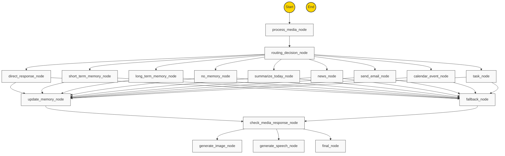

```mermaid
graph TD;
    process_media["process_media_node"];
    routing_decision["routing_decision_node"];
    direct_response["direct_response_node"];
    short_term_memory["short_term_memory_node"];
    long_term_memory["long_term_memory_node"];
    no_memory["no_memory_node"];
    fallback["fallback_node"];
    update_memory["update_memory_node"];
    check_media_response["check_media_response_node"];
    generate_image["generate_image_node"];
    generate_speech["generate_speech_node"];
    summarize_today["summarize_today_node"];
    news["news_node"];
    send_email["send_email_node"];
    calendar_event["calendar_event_node"];
    task["task_node"];
    final["final_node"];
    START((Start));
    END((End));
    START --> process_media;
    process_media --> routing_decision;
    update_memory --> check_media_response;
    fallback --> check_media_response;
    routing_decision --> direct_response;
    routing_decision --> short_term_memory;
    routing_decision --> long_term_memory;
    routing_decision --> no_memory;
    routing_decision --> summarize_today;
    routing_decision --> news;
    routing_decision --> send_email;
    routing_decision --> calendar_event;
    routing_decision --> task;
    direct_response --> update_memory;
    direct_response --> fallback;
    short_term_memory --> update_memory;
    short_term_memory --> fallback;
    long_term_memory --> update_memory;
    long_term_memory --> fallback;
    no_memory --> update_memory;
    no_memory --> fallback;
    summarize_today --> update_memory;
    summarize_today --> fallback;
    news --> update_memory;
    news --> fallback;
    send_email --> update_memory;
    send_email --> fallback;
    calendar_event --> update_memory;
    calendar_event --> fallback;
    task --> update_memory;
    task --> fallback;
    check_media_response --> generate_image;
    check_media_response --> generate_speech;
    check_media_response --> final;
    classDef default fill:#f9f9f9,stroke:#333,stroke-width:1px;
    classDef special fill:#ffd700,stroke:#333,stroke-width:2px;
    class START,END special;
```